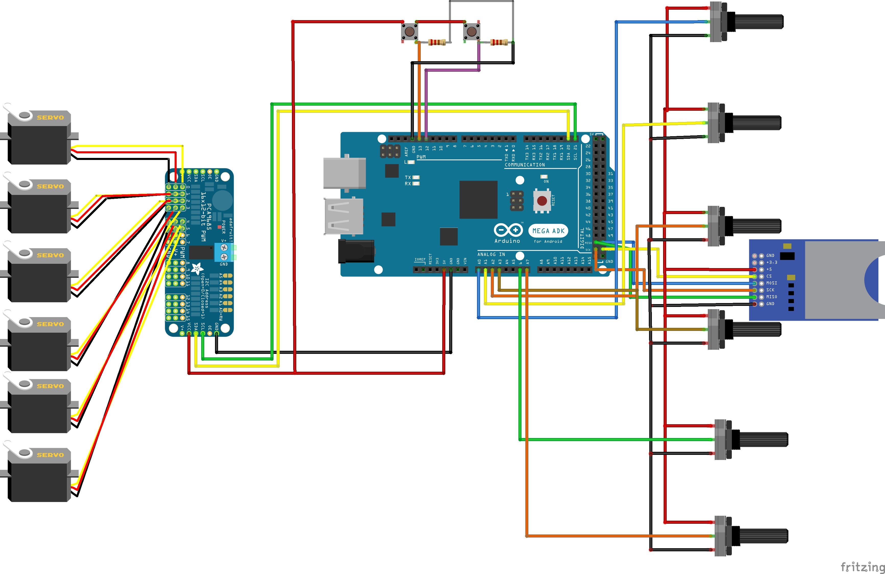

# Robotic Arm Controller with SD Card Logging

This Arduino project controls a robotic arm using an Adafruit PWM Servo Driver (PCA9685). It reads potentiometer values to adjust six servo motors (base, shoulder, elbow, wrist, pivot, and jaws) and logs the positions to an SD card. The system also supports replaying saved positions and includes buttons for switching modes and deleting the stored data.

  


---

## Table of Contents
- [Overview](#overview)
- [Features](#features)
- [Requirements](#requirements)
- [Installation](#installation)
- [Usage](#usage)


---

## Overview

This project demonstrates how to control a robotic arm with six degrees of freedom using an Arduino and an Adafruit PWM servo driver. The system reads analog inputs from potentiometers to set the servo positions in real time, logs these positions to an SD card when in learning mode, and can replay stored positions when prompted. Additional buttons allow you to toggle between modes and delete stored data.

---

## Features

- **Multi-Servo Control:** Operates six servo motors for base, shoulder, elbow, wrist, pivot, and jaws.
- **SD Card Logging:** Saves servo positions to `servopos.txt` on an SD card.
- **Playback Functionality:** Replays saved servo positions.
- **Real-Time Control:** Adjusts servo positions using potentiometer readings.
- **User Interaction:** Buttons for selecting mode (learning/recording), playback, and deleting stored positions.
- **Customizable:** Easily modify and extend for additional functionalities.

---

## Requirements

### Hardware

- Arduino board (e.g., Uno, Mega, etc.)
- Adafruit PWM Servo Driver (PCA9685)
- Servo motors (6 channels)
- SD card module and SD card
- Potentiometers (one per servo channel)
- Push buttons for mode control and playback
- Connecting wires and breadboard

### Libraries

- [Wire](https://www.arduino.cc/reference/en/language/functions/communication/wire/)
- [SPI](https://www.arduino.cc/reference/en/language/functions/communication/spi/)
- [SD](https://www.arduino.cc/reference/en/language/functions/sd/)
- [Adafruit PWM Servo Driver](https://github.com/adafruit/Adafruit-PWM-Servo-Driver-Library)

Install these libraries via the Arduino Library Manager if they are not already installed.

---

## Installation

1. **Clone the Repository:**

    ```bash
    git clone https://github.com/yourusername/robotic-arm-controller.git
    cd robotic-arm-controller
    ```

2. **Open the Project in Arduino IDE:**
   - Open the provided `.ino` file in the Arduino IDE.

3. **Connect the Hardware:**
   - **PWM Servo Driver:** Connect the Adafruit PCA9685 to your Arduino via I2C.
   - **Servos:** Connect each servo to the appropriate channel on the PCA9685 board.
   - **SD Card Module:** Connect the SD card module (ensure the `chipSelect` pin is wired to digital pin 4).
   - **Potentiometers & Buttons:** Connect the potentiometers to analog pins A0, A1, A2, A3, A6, A7 and buttons to the designated digital pins (e.g., `play` on pin 13, `modeBtn` on pin 12, and `delBtn` on pin 10).

4. **Upload the Code:**
   - Compile and upload the code to your Arduino board using the Arduino IDE.

---

## Usage

- **Learning Mode:**  
  When the mode button (`modeBtn`) is pressed (LOW), the system enters learning mode. It reads the current positions (via potentiometers) and logs them to the SD card (`servopos.txt`).

- **Playback Mode:**  
  Press the play button (`play`) to trigger playback. The system will read the stored positions from the SD card and move the servos accordingly.

- **Delete Stored Data:**  
  Press the delete button (`delBtn`) to remove the `servopos.txt` file from the SD card.

- **Monitoring:**  
  Open the Serial Monitor (set to 9600 baud) to view debug messages and status updates.

---


